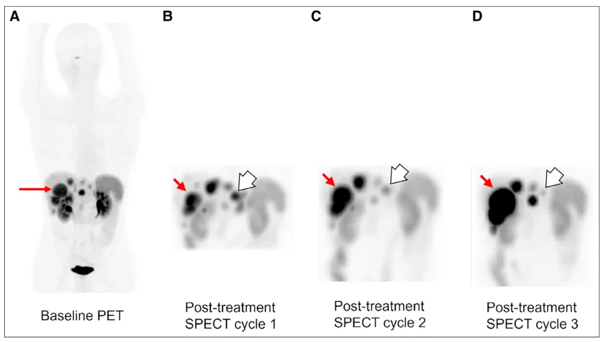
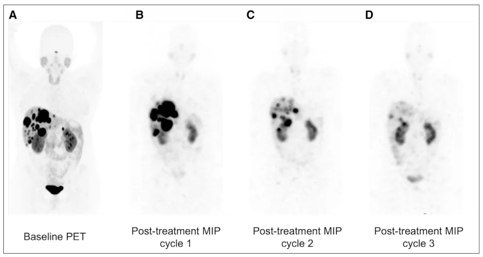
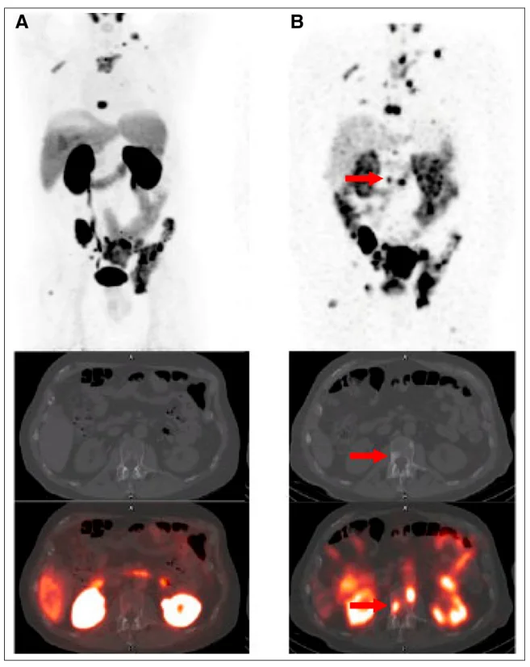
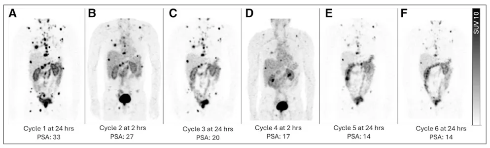
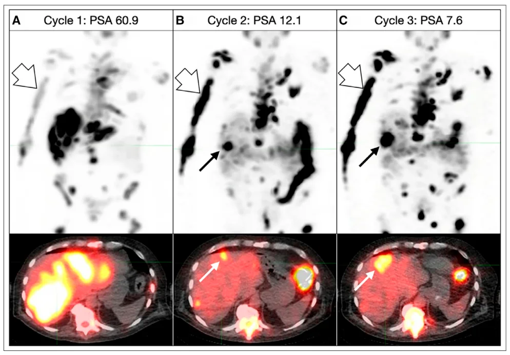
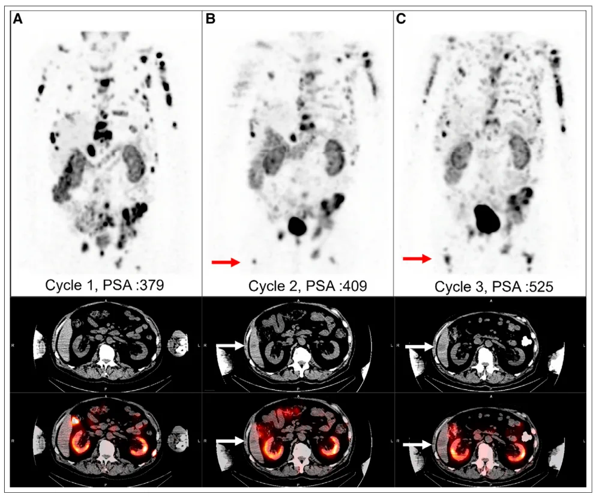

# JNM：Post Treatment Imaging with Lu177 圖解索引

## 使用方式

- 本檔把 JNM Summary 內最有教學價值的 6 張圖裁成 PNG，方便之後做網頁化整理。
- 圖檔位置：`assets/lu177-prrt-figures/`
- **正式公開前仍需確認原刊授權與引用規範。**

## Figure 1：治療中出現新病灶，且反應呈現不均一

- **原文重點**：同一位 grade 3 pancreatic NET 病人，在 serial posttreatment SPECT 中可看到肝病灶體積逐 cycle 增加，但腹部另一個病灶攝取反而下降，最後導致 **提早停止 PRRT**。（JNM 2025，第3頁）
- **臨床圖解**：
  - 紅箭頭：肝病灶變多 / 變大
  - 白箭頭：部分病灶反應變好
- **圖要傳達的決策訊息**：
  - 「整體有反應」不代表所有病灶都在受益。
  - 如果出現 **mixed response**，就要考慮是否：
    - 停止 PRRT
    - 改線
    - 或局部處理 oligoprogression。

## Figure 2：反應很好時，可思考暫停後續 cycle

- **原文重點**：同樣是 pancreatic NET 個案，cycle 1 到 cycle 3 的 posttreatment SPECT 顯示明顯反應，最後 **不再給第 4 cycle**。（JNM 2025，第4頁）
- **臨床圖解**：
  - 病灶負荷一路下降，肝內剩餘病灶在第 3 cycle 時已大幅減少。
- **圖要傳達的決策訊息**：
  - 若剩餘 SSTR-positive disease 已很少，可討論 **pause treatment**，保留後續週期給未來疾病再進展時使用。
  - 這不是自動規則，而是要在團隊討論下做個體化決策。

## Figure 3：診斷 PET 到治療啟動之間，病人可能已經進展

- **原文重點**：病人的 68Ga-PSMA PET 與第一個治療 cycle 之間相隔 2.5 個月；cycle 1 後 24h SPECT/CT 顯示新的 PSMA-avid 骨病灶。（JNM 2025，第5頁）
- **圖要傳達的決策訊息**：
  - 不要把治療前 2-3 個月的 PET 當成永遠有效的 baseline。
  - **cycle 1 的 posttreatment SPECT/CT 可以重設真正的治療 baseline。**

## Figure 4：成像時間點不一致，本身就會製造假性差異

- **原文重點**：同一病人跨 cycle 有些在 24h 拍、有些在 2h 拍；2h 影像看起來病灶較不明顯、blood pool activity 較高，容易誤判。（JNM 2025，第6頁）
- **圖要傳達的決策訊息**：
  - **所有 cycle 的 posttreatment SPECT/CT 時間點必須一致。**
  - 否則你看到的差異可能是方法學差異，不是真正的 biological response。

## Figure 5：PSA 下降，不代表所有病灶都在改善

- **原文重點**：病人 PSA 從 60.9 降到 12.1、再降到 7.6，但影像上肝病灶與骨病灶反應並不一致，後面甚至進展。（JNM 2025，第6頁）
- **圖要傳達的決策訊息**：
  - 生化指標可以改善，但影像仍可能顯示 **spatial heterogeneity**。
  - 不能只用 PSA 或單一 biomarker 來決定療程是否成功。

## Figure 6：CT 成分能抓出 PSMA-negative / 低表現病灶

- **原文重點**：cycle 2 出現新的 PSMA-avid 骨病灶，同時 CT / fused SPECT/CT 顯示新的 **non-PSMA-avid hepatic lesion**；到 cycle 3 又進一步增大並新增更多肝病灶。（JNM 2025，第7頁）
- **圖要傳達的決策訊息**：
  - 只看 SPECT 本身不夠，**CT component 很重要**。
  - 後治療影像的價值不只是看藥物有沒有到，而是找出 **target-positive** 與 **target-negative escape lesions**。

## 這 6 張圖可以怎麼用在網頁上

### 教學模組

- `Figure 1 + Figure 5`：做成「**不要只看總體反應**」單元。
- `Figure 3 + Figure 4`：做成「**基線設定與時間點一致性**」單元。
- `Figure 2`：做成「**何時可以考慮 pause treatment**」單元。
- `Figure 6`：做成「**SPECT/CT 為何比 planar 更有決策價值**」單元。

### 版面語言建議

- 每張圖旁邊適合放三欄：
  - **看到了什麼**
  - **為什麼重要**
  - **會改變什麼決策**

## 圖解總結

- 這篇 JNM 最有價值的，不是單純告訴你「治療後要拍影像」，
- 而是用圖像直接示範：**後治療影像會實際改變停治、續治、局部補強、以及是否需要額外 PET 的決策。**
